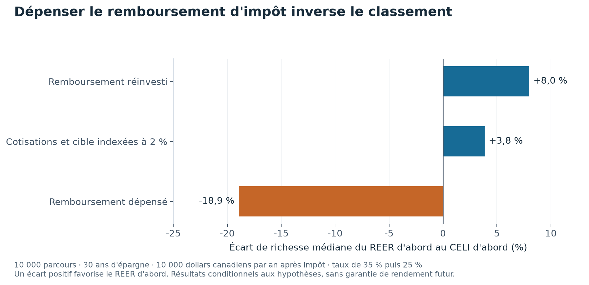

# Épargner pour la retraite sans supposer que chaque année sera bonne

Mettre de l'argent de côté ne suffit pas à connaître son revenu futur. Le compte utilisé, les impôts et l'ordre des bonnes et mauvaises années changent le résultat.

Ce projet compare le REER, où l'impôt est reporté au retrait, et le CELI, où l'argent déjà imposé peut ensuite croître sans impôt. Il rejoue des blocs de douze mois de rendements historiques pour construire 10 000 parcours possibles.

**Le remboursement d'impôt et l'inflation peuvent changer la conclusion d'un plan qui paraît rassurant.**

## Un même effort d'épargne, plusieurs résultats

Le cas étudié prévoit 10 000 dollars canadiens d'épargne annuelle après impôt pendant 30 ans, puis 25 ans de retraite. Le taux d'imposition passe de 35 % à 25 %. Ce sont des hypothèses d'exercice.



Une barre à droite de zéro favorise le REER d'abord. À gauche, le CELI d'abord finit devant. Dépenser le remboursement inverse le classement, même si le taux d'imposition baisse à la retraite.

| Hypothèse | Avantage de richesse médiane du REER d'abord sur le CELI d'abord |
|---|---:|
| Remboursement réinvesti, montants non indexés | +8,0 % |
| Cotisations et revenu cible augmentés de 2 % par an | +3,8 % |
| Remboursement dépensé | −18,9 % |

La richesse médiane est celle du parcours situé au milieu des simulations. Le signe négatif signifie que le CELI d'abord finit devant. [Calculs des trois variantes](results/tables/sensibilites.csv).

## Pourquoi les deux comptes peuvent être équivalents

Avec le même taux d'imposition au dépôt et au retrait, sans plafonds et avec le remboursement entièrement réinvesti, les deux comptes donnent exactement la même somme nette. Le programme vérifie cette égalité avant de simuler les cas plus complexes.

Les rendements proviennent de six fonds canadiens entre novembre 2002 et août 2026. Les mêmes tirages servent à comparer les comptes, afin qu'un ordre ne bénéficie pas par hasard de meilleures années.

## La limite à lire avant les montants

Le cas de référence utilise des dollars courants. Sa cible de 30 000 dollars perd donc du pouvoir d'achat au fil du temps. Lorsque cotisations et cible augmentent de 2 % par an, le taux de réussite du REER d'abord passe de 99,5 % à 90,5 %.

La fiscalité est simplifiée et les droits de cotisation sont figés. Les simulations ne créent pas de crises absentes de l'historique. Ce dépôt explique ces mécanismes et ne remplace pas un plan financier personnel.

## Refaire les calculs

```bash
uv sync --locked --all-extras
uv run pytest
uv run pec fetch
uv run pec simulate
```

Les commandes de téléchargement accèdent aux sources externes. Les résultats publiés restent consultables sans lancer les calculs. Le graphique de présentation se régénère hors réseau avec `uv run python scripts/figure_presentation.py`, depuis les tableaux publiés.

## Pour aller plus loin

[Méthodes, résultats complets et références](docs/ETUDE_DETAILLEE.md) · [Présentation en PDF](rapport/rapport.pdf) · [Citer le projet](CITATION.cff) · [Licence](LICENSE).

## English summary

An RRSP–TFSA simulator compares identical savings budgets under historical return resampling. Reinvesting tax refunds and indexing the savings target materially change the results. Tax rules are simplified.
