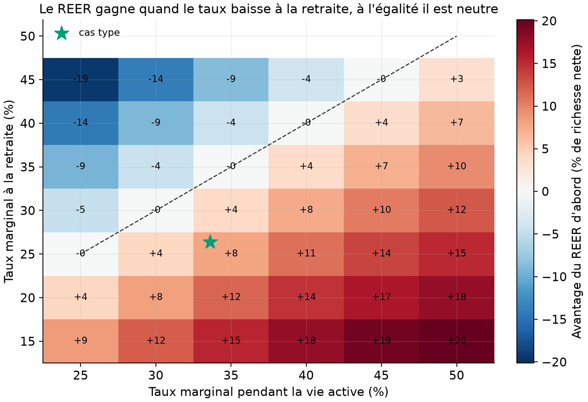
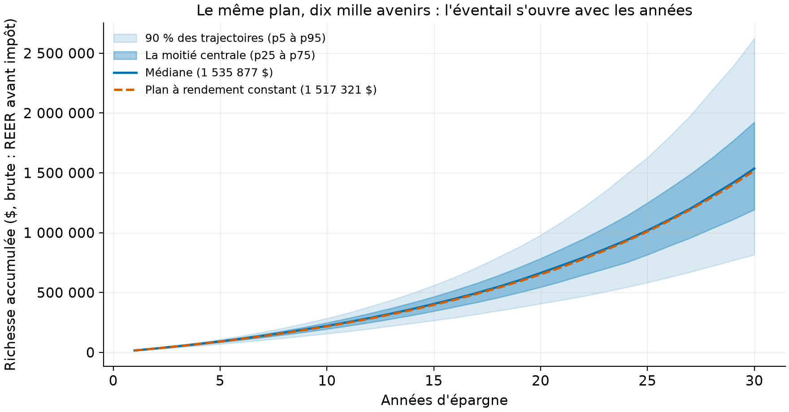
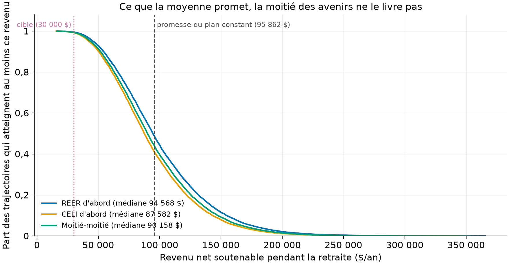

# REER, CELI, ou les deux : le plan d'épargne simulé plutôt que promis

Un simulateur Monte Carlo des trois comptes d'épargne canadiens, alimenté par les rendements
du portefeuille de politique du dépôt 03, avec les équivalences fiscales prouvées par des
tests analytiques exacts. Le seul dépôt du portfolio écrit pour un client final.
*English summary below.*

## En bref

1. **À taux d'imposition égaux, REER et CELI sont EXACTEMENT équivalents.** Ce n'est pas une
   opinion, c'est une identité algébrique, et le simulateur la retrouve à 1e-12 près (testé).
   Tout l'avantage du REER tient dans l'écart entre le taux marginal d'aujourd'hui et celui
   de la retraite : au cas type (35 % actif, 25 % retraité), REER d'abord bat CELI d'abord
   de 8,0 % de richesse nette médiane (1 193 538 $ contre 1 105 368 $, mesuré). La carte des
   taux donne le verdict pour tous les autres profils.
2. **Ce que la moyenne promet, un avenir sur vingt n'en livre pas la moitié.** Le plan « sur
   papier » à rendement constant (7,17 %/an, le composé 2002-2026 du portefeuille) promet un
   revenu de retraite net de 95 862 $/an ; la médiane simulée le tient (94 568 $), mais le
   5e percentile tombe à 45 855 $. La moyenne cache le risque de séquence. (Mesuré.)
3. **Au scénario prudent (rendements amputés de 2 points, déclaré), même la cible de base
   vacille.** À 5,06 %/an, la cible de 30 000 $ nets n'est atteinte que dans 91,2 % des
   avenirs en REER d'abord, 88,0 % en CELI d'abord : l'ordre de remplissage vaut 3 points
   de probabilité de réussite, pas seulement des dollars. (Mesuré.)

Ceci est un exercice de méthode, pas un conseil financier : toutes les règles fiscales sont
des simplifications déclarées et les taux marginaux sont des paramètres à remplacer par les
vôtres.

## La question

Pour un épargnant québécois type, dans quel ordre remplir REER, CELI et compte imposable, et
que devient la probabilité d'atteindre un revenu de retraite cible quand on simule les
rendements au lieu de les supposer constants ? La tension : le REER domine le CELI dans les
comparatifs usuels, or l'identité algébrique dit qu'à taux égaux ils sont indiscernables ;
et le plan déterministe promet un chiffre unique, or dix mille rejeux de l'histoire en font
une distribution.

## Le moteur fiscal, en conventions déclarées

Trois comptes, trois traitements. Le REER, cotisé en argent AVANT impôt : la déduction est
réinvestie immédiatement (convention du « grossing up » : un budget après impôt b achète
b/(1 - t) de cotisation brute), et le retrait est imposé au taux de la retraite. Le CELI,
cotisé après impôt, croît et se retire sans impôt. Le compte non enregistré, cotisé après
impôt, subit chaque année un impôt sur ses gains à l'inclusion de 50 % (gains réputés
réalisés annuellement, pertes créditées immédiatement : simplification déclarée).

La vérité connue qui verrouille le moteur : à taux égaux et sans plafond,

```
b/(1 - t) x (1 + r)^N x (1 - t)  =  b x (1 + r)^N
```

le REER et le CELI produisent le même dollar final, exactement. Le test
`test_reer_egale_celi_quand_les_taux_sont_egaux` l'exige à 1e-12 ; le facteur exact
(1 - t_retraite)/(1 - t_actif) quand les taux diffèrent est testé de même. Le moteur
vectoriel (10 000 trajectoires d'un coup) est contraint d'égaler le moteur scalaire à 1e-8
(testé aussi) : la vitesse n'a pas le droit de changer les chiffres.

Plafonds : 7 000 $ de droits CELI annuels (2026, rapporté) et 12 960 $ de droits REER
(18 % d'un revenu de 72 000 $, cas type, précepte). Ce sont les plafonds, et eux seuls, qui
séparent les trois ordres de remplissage quand les taux sont égaux.

## Le cas type (précepte déclaré, à remplacer par vos chiffres)

10 000 $ d'épargne annuelle après impôt pendant 30 ans ; 25 ans de retraite ; cible de
30 000 $ nets par an HORS RRQ et pension de la Sécurité de la vieillesse ; taux marginal de
35 % pendant la vie active, 25 % à la retraite (chiffres ronds, pas un barème). Les
rendements viennent du portefeuille de politique du dépôt 03 (XIU 25 %, XSP 20 %, XIN 15 %,
XRE 5 %, XBB 25 %, XSB 10 %, mêmes poids, déclaré) : 286 rendements mensuels, 2002-11 à
2026-08, via yfinance (usage personnel, jamais commité).

Le Monte Carlo tire des blocs de 12 mois CONSÉCUTIFS à départ aléatoire : les enchaînements
d'une année de crise (2008, 2020, 2022) restent intacts, les années sont indépendantes entre
elles (convention déclarée). Les mêmes tirages servent aux trois ordres : la comparaison est
appariée, l'écart entre ordres ne doit rien au hasard des tirages.

## Verdict 1 : l'ordre de remplissage (mesuré, `results/tables/resume_ordres.csv`)

| Ordre | P(cible atteinte) | Richesse nette médiane | Revenu soutenable médian | p5 |
|---|---|---|---|---|
| REER d'abord | 99,5 % | 1 193 538 $ | 94 568 $ | 45 855 $ |
| Moitié-moitié | 99,4 % | 1 137 879 $ | 90 158 $ | 43 717 $ |
| CELI d'abord | 99,2 % | 1 105 368 $ | 87 582 $ | 42 468 $ |

**Lecture guidée.** Au cas type, le taux tombe de 10 points à la retraite : chaque dollar
passé par le REER se multiplie par (1 - 0,25)/(1 - 0,35) = 1,154 par rapport au même dollar
en CELI. L'avantage mesuré (8,0 % de richesse nette) est plus petit que 15,4 %, car les
plafonds forcent une partie de l'épargne hors du REER. Le revenu soutenable, le montant net
constant qui épuise exactement le patrimoine sur 25 ans (calculé par bissection sur chaque
trajectoire), ordonne les trois stratégies dans le même sens.



**Comment lire cette figure.** L'avantage du REER d'abord sur le CELI d'abord, en % de
richesse nette, pour chaque couple de taux (vie active en abscisse, retraite en ordonnée).
Sur la diagonale, zéro : c'est l'équivalence algébrique, retrouvée par le simulateur. Sous
la diagonale (le taux baisse à la retraite, le cas usuel), le REER gagne, jusqu'à +20 %.
Au-dessus (taux plus HAUT à la retraite : récupération de la PSV, revenus de retraite
élevés), le CELI gagne, jusqu'à -19 %. L'étoile marque le cas type. Placez vos deux taux,
lisez votre case.

## Verdict 2 : la promesse contre la distribution (mesuré)



**Comment lire cette figure.** Dix mille rejeux du même plan d'épargne. La bande foncée
contient la moitié centrale des avenirs, la bande pâle en contient 90 %. La ligne pointillée
est le plan à rendement constant : il suit la médiane presque exactement (1 517 321 $ contre
1 535 877 $ à l'an 30), et c'est le piège : le chiffre unique du planificateur est BON en
espérance et muet sur l'éventail, qui va du simple au triple entre p5 et p95.



**Comment lire cette figure.** Pour chaque revenu en abscisse, la part des trajectoires
capables de le servir pendant 25 ans. La ligne verticale grise est la promesse du plan
constant (95 862 $) : un peu moins de la moitié des avenirs la tiennent (48 % en REER
d'abord, lisible à l'intersection). La cible de 30 000 $ (pointillé) est quasi sûre sur
l'historique brut ; le tableau prudent ci-dessous la met à l'épreuve.

## Verdict 3 : le scénario prudent (mesuré, `results/tables/resume_ordres_prudent.csv`)

L'échantillon 2002-2026 compose à 7,17 %/an, porté par quinze années de marché haussier ;
le futur n'y a droit à rien. Le scénario prudent retire 2 points par année aux mêmes tirages
(convention déclarée, dans l'esprit des normes de projection de FP Canada) :

| Ordre | Rendement | P(30 000 $ atteints) | Revenu soutenable médian | p5 |
|---|---|---|---|---|
| REER d'abord | 5,06 % | 91,2 % | 53 434 $ | 26 234 $ |
| Moitié-moitié | 5,06 % | 89,3 % | 50 942 $ | 25 011 $ |
| CELI d'abord | 5,06 % | 88,0 % | 49 486 $ | 24 296 $ |

**Lecture guidée.** Deux points de rendement en moins divisent presque le revenu médian par
deux (94 568 $ à 53 434 $) : la capitalisation amplifie tout, dans les deux sens. Et à ce
niveau, l'ordre de remplissage cesse d'être cosmétique : 3,2 points de probabilité de
réussite séparent REER d'abord de CELI d'abord, et le 5e percentile passe SOUS la cible
dans tous les cas : environ un avenir sur vingt ne finance pas 30 000 $/an, quel que soit
l'ordre.

## Reproduire

```bash
uv sync --locked --all-extras
uv run pytest          # 10 tests analytiques, sans réseau
uv run pec fetch       # six FNB, yfinance (usage personnel)
uv run pec simulate    # 3 ordres x 10 000 trajectoires + prudent + carte (~40 s)
```

Les tests sont des vérités fermées : équivalence REER/CELI exacte à taux égaux, facteur
(1 - t_r)/(1 - t_a) exact à taux différents, plafonds respectés au dollar, décumulation à
rendement nul contre la forme fermée (750 000 $ financent exactement 25 ans à 30 000 $
depuis un CELI, 1 000 000 $ depuis un REER à 25 %), bissection retrouvant la forme fermée,
bootstrap reproductible à graine fixée, moteur vectoriel contraint d'égaler le scalaire,
carte neutre sur la diagonale.

## Limites, avec statut

1. **La fiscalité est une maquette.** Taux marginaux constants par période, pas de paliers,
   pas de PSV ni de RRQ, pas de récupération de la PSV, pas de FERR à retraits minimums, pas
   de crédit d'impôt sur dividendes ; le non enregistré impose tout à l'inclusion de 50 %
   chaque année. Chaque règle est déclarée dans `fiscal.py` ; la récupération de la PSV se
   lit dans la carte comme un taux de retraite effectif plus élevé. (Précepte.)
2. **L'échantillon de rendements est court et heureux.** 286 mois dont un seul grand krach ;
   le bootstrap ne crée pas de crises qu'il n'a pas vues ; le scénario prudent est la
   réponse déclarée, pas une prévision. (Mesuré pour l'échantillon, précepte pour le
   prudent.)
3. **Les années simulées sont indépendantes.** Les blocs de 12 mois préservent les
   enchaînements intra-année, pas les cycles pluriannuels (un marché baissier de trois ans
   est sous-représenté). (Déclaré.)
4. **Les plafonds sont figés** au niveau 2026 pendant 30 ans, sans indexation ni droits
   inutilisés reportés. (Déclaré ; l'indexation des deux plafonds jouerait dans le même
   sens pour les trois ordres.)
5. **Aucun conseil.** Ce dépôt compare des mécaniques sous hypothèses déclarées ; il ne
   connaît ni votre revenu, ni vos taux réels, ni votre tolérance au risque.

## Références

- Normes de projection de FP Canada et de l'IQPF (hypothèses de rendement pour la
  planification, publiées annuellement) : l'esprit du scénario prudent.
- Milevsky, M. A., *The Calculus of Retirement Income*, Cambridge University Press, 2006 :
  le revenu soutenable et la ruine stochastique.
- Bengen, W. (1994), « Determining withdrawal rates using historical data », *Journal of
  Financial Planning* : l'ancêtre du retrait soutenable simulé.
- Agence du revenu du Canada et Revenu Québec : mécanique REER/CELI (les règles simplifiées
  du moteur s'y réfèrent, sans en reproduire les barèmes).

## English summary

A Monte Carlo simulator of Canada's three savings vehicles (RRSP, TFSA, taxable), driven by
one-year block bootstrap of the repo-03 policy portfolio (286 monthly returns, 2002-2026),
with the tax mechanics locked by exact analytic tests: with equal marginal tax rates and no
caps, RRSP and TFSA compound to the SAME final dollar (tested to 1e-12), and the entire
RRSP advantage is the factor (1 - t_ret)/(1 - t_work). Base case (35 % working, 25 %
retired): RRSP-first beats TFSA-first by 8.0 % of median after-tax wealth; a tax-rate map
gives the verdict for every other profile, exactly zero on the diagonal. The deterministic
plan (7.17 %/yr, the 2002-2026 compound) promises a $95,862 sustainable retirement income;
the simulated median delivers it, but the 5th percentile is $45,855. Under a declared
prudent scenario (returns minus 2 points), the basic $30,000 target is only reached in
91.2 % of futures (RRSP-first) versus 88.0 % (TFSA-first): filling order buys 3 points of
success probability. Simplified declared tax conventions, no OAS/QPP, no advice; 10
closed-form tests, no network.

## Licence et citation

Code sous licence MIT ; rapport et figures CC BY 4.0. Données : Yahoo Finance (usage
personnel, jamais commitées). Citer via `CITATION.cff`.
